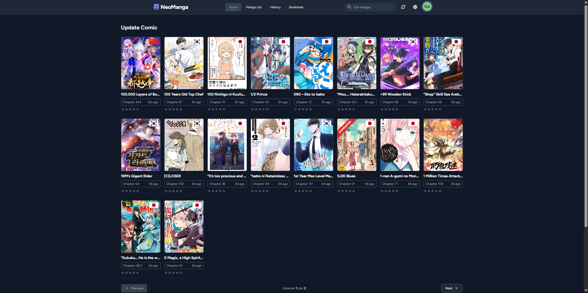
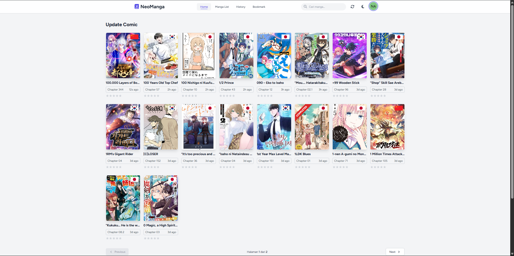
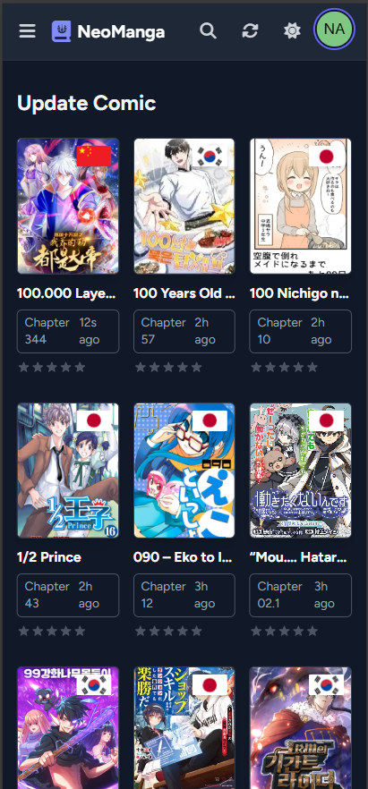

# NeoManga - A Modern Web Reader for Manga & Comics



<p align="center">
  
  
  
  
</p>

**NeoManga** adalah sebuah aplikasi web yang elegan dan modern, dibangun dengan Laravel, yang dirancang untuk memberikan pengalaman membaca manga, manhwa, manhua, dan webtoon yang lancar dan menyenangkan. Dengan antarmuka yang bersih, desain responsif, dan fitur-fitur yang berpusat pada pengguna, NeoManga bertujuan untuk menjadi platform pilihan bagi para penggemar komik.

## ✨ Fitur Utama

-   **Desain Modern & Responsif**: Dibangun dengan Tailwind CSS, NeoManga memberikan UI yang indah dan dapat diakses di semua perangkat, dari desktop hingga ponsel.
-   **Mode Terang & Gelap**: Beralih antara tema terang dan gelap dengan mudah untuk kenyamanan membaca kapan saja, siang atau malam.
-   **Katalog Manga Komprehensif**: Jelajahi perpustakaan manga yang luas, diurutkan dan dapat dicari.
-   **Kategori & Genre**: Temukan seri baru dengan mudah melalui sistem kategori dan genre yang terorganisir.
-   **Akun Pengguna**: Daftar dan login untuk mengakses fitur-fitur yang dipersonalisasi.
-   **Daftar Favorit**: Simpan manga favorit Anda dalam satu daftar yang mudah diakses.
-   **Pencarian Cepat**: Temukan manga yang Anda cari secara instan dengan bilah pencarian yang terintegrasi.
-   **Reader yang Dioptimalkan**: Halaman baca yang dirancang untuk tidak mengganggu, mendukung mode baca vertikal (cocok untuk webtoon).
-   **Panel Admin (Otorisasi)**: Tautan khusus untuk administrator mengelola konten situs (memerlukan implementasi backend lebih lanjut).
-   **SEO-Friendly**: Struktur URL yang bersih dan layout yang mendukung optimasi mesin pencari.

## 🚀 Teknologi yang Digunakan

-   **Backend**: Laravel 12, PHP 8.1+
-   **Frontend**: Tailwind CSS 3
-   **Database**: MySQL / PostgreSQL
-   **Development Tools**: Vite, Composer, NPM

## 📸 Tampilan Aplikasi

*(Sangat disarankan untuk menambahkan beberapa screenshot aplikasi Anda di sini untuk menunjukkan tampilannya secara visual)*

| Halaman Utama (Light Mode)                               | Halaman Baca (Dark Mode)                               |
| :-------------------------------------------------------: | :-----------------------------------------------------: |
|  |  |

| Profil Pengguna                                          | Menu Mobile                                          |
| :------------------------------------------------------: | :---------------------------------------------------: |
|  |  |

## 🛠️ Instalasi & Setup Lokal

Ikuti langkah-langkah berikut untuk menjalankan NeoManga di lingkungan lokal Anda.

**Prasyarat:**
-   Composer
-   Node.js & NPM
-   Database (misalnya, MySQL, MariaDB)

**Langkah-langkah:**

1.  **Clone repositori:**
    ```bash
    git clone https://github.com/barastrong/neomanga.git
    cd neomanga
    ```

2.  **Install dependensi PHP:**
    ```bash
    composer install
    ```

3.  **Buat file environment:**
    ```bash
    cp .env.example .env
    ```

4.  **Generate kunci aplikasi:**
    ```bash
    php artisan key:generate
    ```

5.  **Konfigurasi database Anda di file `.env`:**
    ```env
    DB_CONNECTION=mysql
    DB_HOST=127.0.0.1
    DB_PORT=3306
    DB_DATABASE=neomanga
    DB_USERNAME=root
    DB_PASSWORD=
    ```

6.  **Jalankan migrasi database (dan seeder jika ada):**
    ```bash
    php artisan migrate --seed
    ```

7.  **Install dependensi JavaScript:**
    ```bash
    npm install
    ```

8.  **Jalankan Vite untuk kompilasi aset:**
    ```bash
    # Untuk development (dengan hot-reloading)
    npm run dev

    # Atau untuk production
    npm run build
    ```

9.  **Jalankan server development Laravel:**
    ```bash
    php artisan serve
    ```

Aplikasi sekarang akan tersedia di `http://127.0.0.1:8000`.

## 🗺️ Rencana Pengembangan (Roadmap)

Berikut adalah beberapa fitur yang direncanakan untuk pengembangan di masa depan:
-   [ ] Sistem Komentar pada setiap Chapter
-   [ ] Peringkat & Ulasan Manga oleh Pengguna
-   [ ] Notifikasi Chapter Baru untuk Manga Favorit
-   [ ] Riwayat Baca (Menandai chapter yang sudah dibaca)
-   [ ] Panel Admin yang lebih lengkap (Manajemen Manga, Chapter, Pengguna)
-   [ ] Dukungan Multi-bahasa (Internationalization)
-   [ ] API untuk aplikasi pihak ketiga atau mobile.

## 🤝 Berkontribusi

Kontribusi sangat kami hargai! Jika Anda ingin membantu mengembangkan NeoManga, silakan:

1.  **Fork** repositori ini.
2.  Buat **Branch** baru (`git checkout -b feature/FiturBaru`).
3.  **Commit** perubahan Anda (`git commit -m 'Menambahkan FiturBaru'`).
4.  **Push** ke branch (`git push origin feature/FiturBaru`).
5.  Buka sebuah **Pull Request**.

Harap pastikan kode Anda mengikuti standar coding yang ada dan menyertakan dokumentasi yang relevan.

## 📝 Lisensi

Proyek ini dilisensikan di bawah [MIT License](LICENSE.md).

---

Dibuat dengan ❤️ oleh [Error] <!-- Ganti dengan nama atau username Anda -->
